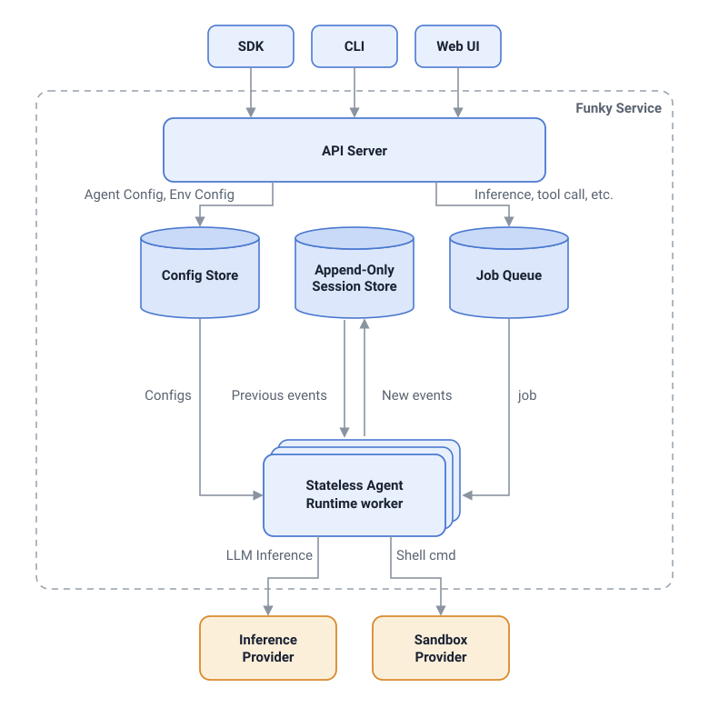

# Funky

The durable runtime for agents.

Define an agent, give it a sandboxed environment, send it work. Funky records every session
as an append-only log in Postgres and runs the agent loop on stateless workers — a worker
can die mid-run (SIGKILL, OOM, a deploy) and a fresh one resumes from the log with nothing
lost and no side effect run twice.

## Quickstart

Requires Docker, an [E2B](https://e2b.dev) API key, and a key for at least one model
provider: [Anthropic](https://console.anthropic.com), [OpenAI](https://platform.openai.com),
[Google](https://aistudio.google.com/apikey), or [Together AI](https://api.together.ai).

```bash
git clone https://github.com/funkyhq/funky && cd funky
cp .env.example .env        # the auth token, a model-provider key, and the E2B key
docker compose up --build
```

You can interact with the Funky service through Web UI or CURL.

**The console**, at <http://localhost:5173>. Define an agent, give it an environment, start a
session, and watch the log stream live — all in the browser. It proxies the api and attaches
the token itself, so no credential ever reaches the page.


**The api**, at `localhost:3000` — bearer-authed, and the same five steps with curl:

```bash
export TOKEN=<your FUNKY_AUTH_TOKEN>
export H="Authorization: Bearer $TOKEN"
export J="content-type: application/json"

# 1. an agent config: the model and the system prompt
AID=$(curl -s localhost:3000/v1/agent-configs -H "$H" -H "$J" -d '{
  "inference": { "provider": "anthropic", "model": "claude-sonnet-5", "maxTokens": 2048 },
  "systemPrompt": "You are an autonomous agent in a fresh Linux sandbox."
}' | jq -r .id)

# 2. an env config: the sandbox recipe (the defaults are fine)
EID=$(curl -s localhost:3000/v1/env-configs -H "$H" -H "$J" -d '{}' | jq -r .id)

# 3. a session: one agent config + one env config + a durable entry log
SID=$(curl -s localhost:3000/v1/sessions -H "$H" -H "$J" \
  -d "{\"agentConfigId\":\"$AID\",\"envConfigId\":\"$EID\"}" | jq -r .id)

# 4. watch the log stream live (leave this running)
curl -N -H "$H" localhost:3000/v1/sessions/$SID/stream &

# 5. give it work
curl -s localhost:3000/v1/sessions/$SID/messages -H "$H" -H "$J" \
  -d '{"content":"Run uname -a in your sandbox and tell me what you see."}'
```

Agent configs can be updated with `POST /v1/agent-configs/$AID`. Send only the fields to
replace; omitted fields are preserved. Responses include a monotonic `version`: include the
current value in an update for optimistic concurrency (a stale value returns 409), or omit it
for an unconditional last-write-wins update.

The message answers `202 {"kind":"started", ...}` — accepted, not done. A worker claims the
run, provisions an E2B sandbox the moment a tool actually executes (an inference-only turn
never pays for one), and every committed step lands on the stream as one SSE event — `id:`
is the entry's `seq`, `data:` is the same JSON `GET /entries` returns:

```
id: 0
data: {"seq":0,"type":"message","message":{"role":"user","content":[...]}}

id: 1
data: {"seq":1,"type":"message","message":{"role":"assistant","content":[{"type":"toolCall","name":"bash",...}],"stopReason":"tool_use"}}

id: 2
data: {"seq":2,"type":"message","message":{"role":"toolResult","toolCallId":"...","content":[...]}}

id: 3
data: {"seq":3,"type":"message","message":{"role":"assistant","content":[{"type":"text","text":"It's a Linux system..."}],"stopReason":"end_turn"}}
```

Disconnect and reconnect any time: the stream replays from a cursor (`?after=`, or the
SSE-native `Last-Event-ID` an auto-reconnecting EventSource sends), so a dropped client
misses nothing. Ctrl-C the stream when done; `docker compose down` stops the stack (`-v`
also wipes the database).

Scale workers with `docker compose up -d --scale worker=3` — claiming is the only
scheduler; nothing else changes.

### Model providers

A config's `inference.provider` picks the vendor that serves it. At boot the worker wires
one inference adapter per model-provider key it finds and routes each step to the adapter
the session's config names, so one stack runs sessions on different vendors side by side:

| `inference.provider` | key                            |
| -------------------- | ------------------------------ |
| `anthropic`          | `ANTHROPIC_API_KEY`            |
| `openai`             | `OPENAI_API_KEY`               |
| `google`             | `GOOGLE_GENERATIVE_AI_API_KEY` |
| `togetherai`         | `TOGETHER_API_KEY`             |

Inference goes through the [Vercel AI SDK](https://ai-sdk.dev) behind a vendor-neutral
port.

## Why Funky?

Most runtimes keep the agent's loop, memory, and state in one process; when it dies,
in-flight work dies with it. Funky decouples them:

- **The log is the agent.** Every session is an append-only entry log in Postgres. Workers
  are stateless: each step is claim → step → commit in one transaction, and an interrupted
  step is never committed.
- **Crash-safe by construction, not by drain.** Workers have no shutdown path — SIGKILL is
  the shutdown story, so crash-safety is exercised on every shutdown. A dying worker's
  lease expires and any worker resumes from the unchanged log. Tool executions are
  at-most-once across crashes: a killed batch settles as interrupted results the model can
  see and retry — never a silently duplicated side effect.
- **One rendezvous.** The api and the workers never talk to each other; Postgres is the
  only coordination point. The SSE stream is the same log, delivered incrementally.
- **Sandboxes outlive workers.** Commands run in a per-session [E2B](https://e2b.dev)
  sandbox, bound to the session in the store — any worker reconnects to the same box.

## Architecture Diagram



## Layout

| Path                | What it is                                                                                       |
| ------------------- | ------------------------------------------------------------------------------------------------ |
| `packages/core`     | The vocabulary: zod schemas for messages, entries, configs, and tool specs                       |
| `packages/agent`    | The engine and driver: inference fold, tool execution, the claim → step → commit loop; the ports |
| `packages/adapters` | The port implementations: Postgres store (drizzle), AI SDK inference, E2B sandboxes              |
| `apps/api`          | The HTTP surface (Hono): configs, sessions, intake, cancel, inspection, the SSE stream           |
| `apps/worker`       | The runDriver host — the process a container runs                                                |
| `apps/web`          | The browser console over the api (React + Vite); compose serves it on `:5173`                    |

## Development

```bash
pnpm install
pnpm test            # unit + PGlite-backed suites; no network, no keys
pnpm typecheck
pnpm format:check
```

The store conformance suite also runs against a real Postgres when
`STORE_TEST_DATABASE_URL` is set (CI provisions one). An opt-in end-to-end suite — real
model, real sandbox, `kill -9` recovery, and a two-process api+worker run observed entirely
over HTTP — is gated on `E2E_DATABASE_URL` (a scratch database), `ANTHROPIC_API_KEY`, and
`E2B_API_KEY`:

```bash
E2E_DATABASE_URL=postgres://... pnpm -F worker test   # with the keys in the environment
```

## Contributing

Early-stage. The best contribution right now is feedback on the interfaces — open an issue
to discuss the protocol, a missing method, or a backend you'd want to plug in.

## License

[Apache 2.0](./LICENSE).
