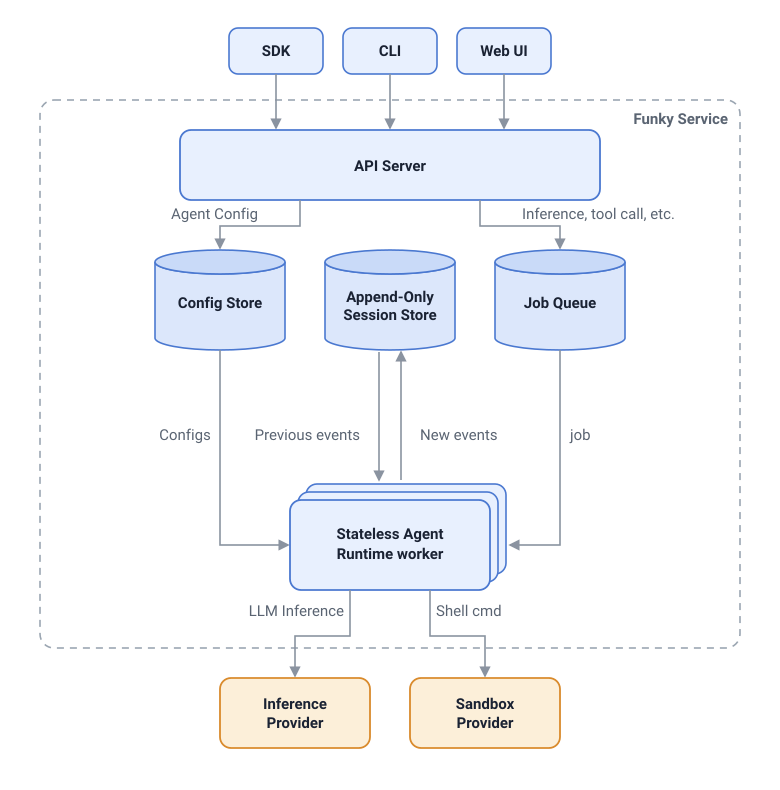

# Funky

The batch engine for AI agents.

Funky is your always-on task force for running parallel, long-lived agent workloads at scale.

Define your agents, give them sandboxed environments, and send them work. Funky runs
sessions in parallel across stateless workers and records every session as an append-only
log in Postgres. A worker can die mid-run (SIGKILL, OOM, a deploy) and a fresh one resumes
from the log, keeping long-lived workloads moving without repeating side effects.

## Quickstart

Requires Docker, an [E2B](https://e2b.dev) API key, and a key for at least one model
provider: [Anthropic](https://console.anthropic.com), [OpenAI](https://platform.openai.com),
[Google](https://aistudio.google.com/apikey), [Together AI](https://api.together.ai), or
[xAI](https://console.x.ai).

```bash
git clone https://github.com/funkyhq/funky && cd funky
cp .env.example .env        # the auth token, a model-provider key, and the E2B key
docker compose up --build
```

You can interact with the Funky service through Web UI or CURL.

**The console**, at <http://localhost:5173>. Define an agent and its sandbox, give it a
task, and watch its log grow — all in the browser. It proxies the api and attaches
the token itself, so no credential ever reaches the page.


**The api**, at `localhost:3000` — bearer-authed, and the same steps with curl:

```bash
export TOKEN=<your FUNKY_AUTH_TOKEN>
export H="Authorization: Bearer $TOKEN"
export J="content-type: application/json"

# 1. an agent config: the model, the system prompt, and its sandbox's network, packages, keys,
#    setup commands and size
AID=$(curl -s localhost:3000/v1/agent-configs -H "$H" -H "$J" -d '{
  "inference": { "provider": "anthropic", "model": "claude-sonnet-5", "maxTokens": 2048 },
  "systemPrompt": "You are an autonomous agent in a fresh Linux sandbox.",
  "network": { "type": "unrestricted" },
  "packages": {},
  "credentials": [],
  "setupCommands": [],
  "resources": {}
}' | jq -r .id)

# 2. a task: the work, handed to the agent config. It starts a session running it, and the
#    answer's sessionId is where that session's log lives
SID=$(curl -s localhost:3000/v1/tasks -H "$H" -H "$J" -d "{
  \"agentConfigId\": \"$AID\",
  \"content\": \"Run uname -a in your sandbox and tell me what you see.\"
}" | jq -r .sessionId)

# 3. follow the log: each poll asks only for what is newer than the last seq seen
#    (an answer that isn't a list of entries is an error: print it and stop)
Q=""
while sleep 1; do
  NEW=$(curl -s -H "$H" "localhost:3000/v1/sessions/$SID/entries$Q")
  echo "$NEW" | jq -e 'type == "array"' >/dev/null || { echo "$NEW" >&2; break; }
  echo "$NEW" | jq -c '.[]'
  LAST=$(echo "$NEW" | jq '.[-1].seq // empty')
  [ -n "$LAST" ] && Q="?after=$LAST"
done
```

Agent configs can be updated with `POST /v1/agent-configs/$AID`. Send only the fields to
replace; omitted fields are preserved. Responses include a monotonic `version`: include the
current value in an update for optimistic concurrency (a stale value returns 409), or omit it
for an unconditional last-write-wins update. A task pins the version current when it was
created — behavior and sandbox together — so an update reaches only tasks created after it.
`GET /v1/agent-configs/$AID?version=N` reads a pinned version; without `version` it is the
current one.
`packages` are installed into the sandbox before the agent's first tool call; see
[Packages](#packages). `credentials` let the agent use API keys it can't read; see
[Credentials](#credentials).

The task answers `201` with its `id` and the `sessionId` it started — accepted, not done. A
worker claims the run, provisions an E2B sandbox the moment a tool actually executes (an
inference-only turn never pays for one), and every committed step lands in the session's log
as one entry — `seq` is its place in the log, and `GET /entries?after=<seq>` answers
everything after it, in order:

```
{"seq":0,"type":"message","message":{"role":"user","content":[...]}}
{"seq":1,"type":"message","message":{"role":"assistant","content":[{"type":"toolCall","name":"bash",...}],"stopReason":"tool_use"}}
{"seq":2,"type":"message","message":{"role":"toolResult","toolCallId":"...","content":[...]}}
{"seq":3,"type":"message","message":{"role":"assistant","content":[{"type":"text","text":"It's a Linux system..."}],"stopReason":"end_turn"}}
```

There is no push: Funky runs deferrable work, so you poll as often as you care to, or check
back hours later. The cursor is just the last `seq` you hold, so a client that stops and
comes back misses nothing. Ctrl-C the loop when done; `docker compose down` stops the stack
(`-v` also wipes the database).

Scale workers with `docker compose up -d --scale worker=3` — claiming is the only
scheduler; nothing else changes. A worker runs one step at a time by default;
`FUNKY_CONCURRENCY=8` in `.env` has each hold eight claims at once (one process, one pool,
one drain), so a small container serves many sessions while their steps wait on a model or
a sandbox. Scale down the same way: a removed worker stops claiming, finishes a short step
or hands a long one back, and exits.

### Tasks

A task creates a session on an agent config and gives it its first message in one call, so
a failure never leaves an empty session behind. The session is an ordinary one: it takes
follow-up messages with `POST /v1/sessions/$SID/messages`, and the log above is its log.
`GET /v1/tasks` lists a namespace's tasks, newest first; `GET /v1/tasks/:id` reads one back;
`POST /v1/tasks/:id/cancel` cancels its session's run. `POST /v1/sessions` still creates a
bare session for experiments, but the console starts work only as tasks.

### Usage

`GET /v1/sessions/$SID/usage/summary` answers what a session has used so far:

```
{"tokens":{"input":50320,"output":2262,"cacheRead":38000,"cacheWrite":4000},"runtimeSeconds":41.7}
```

`tokens` sums the usage the provider reported on each assistant message; `input` includes
the cache reads and writes. An errored or aborted message carries none, so it adds nothing.
`GET /v1/sessions/$SID/usage` lists the same counts per message. `runtimeSeconds` is how
long the session's runs have taken, each from its first message to its end. Idle time
between runs isn't counted, and a run still going counts up to now. It measures Funky
working on the session, not what the sandbox provider bills: an E2B sandbox runs from the
run's first tool call until the worker pauses it at the run's end (or, should that pause
never happen, until its timeout, `FUNKY_SANDBOX_TIMEOUT_MS`, 30 minutes by default). The
console shows a session's token total beside its log.

### Usage webhook

To meter usage outside Funky, set `FUNKY_USAGE_WEBHOOK_URL` and `FUNKY_USAGE_WEBHOOK_SECRET`
on the worker. Each usage event is then POSTed to the URL right after the worker commits it,
one request per event. There are two kinds. A `tokens` event is one assistant message that
carries usage:

```
POST /your/usage/endpoint
Content-Type: application/json
Idempotency-Key: 6f1c…
Funky-Signature: t=1794268805,v1=5d41…

{"namespace":"default","sessionId":"…","eventId":"6f1c…","kind":"tokens","entryId":"…",
 "provider":"anthropic","model":"claude-opus-5",
 "usage":{"input":50320,"output":2262,"cacheRead":38000,"cacheWrite":4000},
 "createdAt":"2026-11-10T00:00:05.123Z"}
```

A `runtime` event is one step of a run (a work item: an inference call, or a round of tool
calls), sent when the worker commits it:

```
{"namespace":"default","sessionId":"…","eventId":"9b2e…","kind":"runtime","itemId":"…",
 "createdAt":"2026-11-10T00:00:01.000Z","finishedAt":"2026-11-10T00:00:05.123Z",
 "durationMs":4123,"resources":{"cpuCount":2,"memoryMB":1024}}
```

`usage` is the counts the provider reported, as `GET /v1/sessions/$SID/usage` lists them.
A runtime event's span runs from when the step was queued to when it was committed, and a
run's steps meet end to end, so its runtime events add up to the run (the `runtimeSeconds`
above). `resources` is the sandbox size the session's agent config version asks for, with
the defaults filled in, whether or not that step used the sandbox. There are no prices. To
check a request came from Funky, compute HMAC-SHA256 of `<t>.<raw body>` with the secret,
compare it to `v1` in constant time, and reject a `t` far from your clock. Any 2xx counts
as delivered. Anything else, a timeout (10s) or no answer at all is retried, starting at
30 seconds and doubling up to an hour, until the receiver accepts it. Events stay in
Postgres until they're delivered, so a worker that restarts, or any other worker, sends
what one that died left behind, about a minute after the commit. Delivery is at least
once, and a retry can repeat an event the receiver already took, so dedupe on `eventId`.

With the URL unset, nothing is sent. Funky still records each event in the `usage_events`
table, and setting the URL later sends every event that hasn't been delivered, back to the
release that added the table.

### Model providers

A config's `inference.provider` picks the vendor that serves it. At boot the worker wires
one inference adapter per model-provider key it finds and routes each step to the adapter
the session's config names, so one stack runs sessions on different vendors side by side:

| `inference.provider` | key                            |
| -------------------- | ------------------------------ |
| `anthropic`          | `ANTHROPIC_API_KEY`            |
| `openai`             | `OPENAI_API_KEY`               |
| `google`             | `GOOGLE_GENERATIVE_AI_API_KEY` |
| `togetherai`         | `TOGETHER_API_KEY`             |
| `xai`                | `XAI_API_KEY`                  |

Inference goes through the [Vercel AI SDK](https://ai-sdk.dev) behind a vendor-neutral
port.

Every Anthropic call opts into prompt caching (Anthropic's automatic caching, 5-minute
lifetime). A run resends its conversation on each step, so when steps follow within five
minutes, most of a step's input is a cache read, which Anthropic bills at a small fraction
of the input price. Writing the cache costs more than plain input (1.25x), so a single-step
run, or a step after a gap of more than five minutes, pays a little more, not less. Prompts
under the model's minimum cacheable length (512 tokens on the 5.5 models) are not cached.
The usage counts above show it as `cacheRead` and `cacheWrite`. OpenAI and Gemini cache
repeated prefixes on their own.

### Packages

`packages` maps a package manager to specs in its own syntax:

```json
"packages": { "apt": ["graphviz"], "pip": ["pandas==2.2.0"], "npm": ["express@4.18.0"] }
```

Supported on E2B: `apt`, `pip`, `npm`. Each package set is built once into an E2B template
and shared by every session that uses it, so packages work under any `network` policy.

- The first session on a new set waits for the build.
- Unpinned specs resolve once, at the first build. Pin versions to control them.
- A spec that fails to install ends the run as `"error"`, with the reason in the tool result.

### Setup commands

`setupCommands` run after the packages install, in the same build:

```json
"setupCommands": ["echo 'hello world' > ~/hello.txt"]
```

- Each runs in its own shell, in order, as the sandbox's user.
- They run once per build, not per session, so they see no credentials.
- A command that fails ends the run as `"error"`, naming it. Give downloads their own retries.

### Resources

`resources` sizes the sandbox: `cpuCount` vCPUs and `memoryMB` MiB of memory. A field left
out is the default, **2 vCPUs and 1024 MiB**, so `{}` is 2 and 1024:

```json
"resources": { "cpuCount": 4, "memoryMB": 4096 }
```

- On E2B the size is built into the template, like packages, so changing it means one new
  build before the next session starts.
- A Deno or Node build, or a large `git` checkout, can outgrow the default. When memory runs
  out, commands hang until they time out (exit code 124).
- E2B wants memory in even MiB and vCPUs as 1 or an even number, and caps both by plan
  (8192 MiB on the plan tested). A size it refuses ends the run as `"error"` with its reason.

### Secrets

Most setups skip this. It's only for API keys your agent's tools use, such as a Stripe or
GitHub key: Funky stores them by name (`/v1/secrets`) in [Infisical](https://infisical.com)
rather than Postgres, and agent configs hand them to sandboxes as
[credentials](#credentials). Without it, those routes answer 404 "no secret store configured".

1. In [Infisical Cloud](https://app.infisical.com) (the free plan is enough), create a project,
   and under its **Access Control → Machine Identities** create an identity with the **Member**
   role.
2. On the identity's page, copy the **Client ID** under **Universal Auth** (not the Identity ID),
   and add a client secret.
3. Put them in `.env` with the project's ID (**Project Settings → Copy Project ID**), and run
   `docker compose up -d` again:

   ```bash
   INFISICAL_CLIENT_ID=...
   INFISICAL_CLIENT_SECRET=...
   INFISICAL_PROJECT_ID=...
   INFISICAL_ENVIRONMENT=dev
   ```

`PUT /v1/secrets/stripe-live` with `{"value": "sk_live_…"}` stores a key, `GET /v1/secrets` lists
the names (never the values), and `DELETE /v1/secrets/stripe-live` removes one.

### Credentials

A credential lets the agent use a stored key it can't read:

```json
"credentials": [
  {
    "type": "injected",
    "env": "STRIPE_API_KEY",
    "secret": "stripe-live",
    "domains": ["api.stripe.com"],
    "header": "Authorization",
    "value": "Bearer {secret}"
  }
]
```

Outside the sandbox, E2B's egress proxy sets `Authorization: Bearer <the stripe-live key>` on
HTTPS requests to `api.stripe.com`. Inside, `STRIPE_API_KEY` holds a placeholder, `funky-injected`.

- Keys are read when a sandbox is created, so a changed key misses sessions that already have one.
- Headers only: a key that belongs in a URL, a body or a signature (AWS) can't be injected.
- Tools that check a key's format, like the Stripe CLI, need a stand-in in that format instead,
  and tools that keep their key in a file need it registered by a
  [setup command](#setup-commands).
- A host on `domains` that echoes request headers hands the key back to the agent.

## Why Funky?

Most runtimes keep the agent's loop, memory, and state in one process; when it dies,
in-flight work dies with it. Funky decouples them:

- **The log is the agent.** Every session is an append-only entry log in Postgres. Workers
  are stateless: each step is claim → step → commit in one transaction, and an interrupted
  step is never committed.
- **Crash-safe by construction, not by drain.** SIGKILL is the shutdown story: a dying
  worker's lease expires and any worker resumes from the unchanged log, so crash-safety is
  exercised on every unplanned death. Tool executions are at-most-once across crashes: a
  killed batch settles as interrupted results the model can see and retry — never a
  silently duplicated side effect. Draining on SIGTERM only makes a planned removal cheap:
  the worker stops claiming, and a step that cannot finish in time is handed back at once
  (its lease released) instead of after the lease runs out.
- **One rendezvous.** The api and the workers never talk to each other; Postgres is the
  only coordination point. Clients follow a session by polling that same log from a cursor.
- **Sandboxes outlive workers.** Commands run in a per-session [E2B](https://e2b.dev)
  sandbox, bound to the session in the store — any worker reconnects to the same box.

## Architecture Diagram



## Layout

| Path                | What it is                                                                                             |
| ------------------- | ------------------------------------------------------------------------------------------------------ |
| `packages/core`     | The vocabulary: zod schemas for messages, entries, configs, and tool specs                             |
| `packages/agent`    | The engine and driver: inference fold, tool execution, the claim → step → commit loop; the ports       |
| `packages/adapters` | The port implementations: Postgres store (drizzle), AI SDK inference, E2B sandboxes, Infisical secrets |
| `apps/api`          | The HTTP surface (Hono): configs, secrets, tasks, sessions, intake, cancel, inspection                 |
| `apps/worker`       | The runDriver host — the process a container runs; reads credentials' keys when a sandbox is created   |
| `apps/web`          | The browser console over the api (React + Vite); compose serves it on `:5173`                          |

## Development

```bash
pnpm install
pnpm test            # unit + PGlite-backed suites; no network, no keys
pnpm typecheck
pnpm format:check
```

The store conformance suite also runs against a real Postgres when
`STORE_TEST_DATABASE_URL` is set (CI provisions one). An opt-in end-to-end suite — real
model, real sandbox, `kill -9` recovery, and a two-process api+worker run observed entirely
over HTTP — is gated on `E2E_DATABASE_URL` (a scratch database), `ANTHROPIC_API_KEY`, and
`E2B_API_KEY`:

```bash
E2E_DATABASE_URL=postgres://... pnpm -F worker test   # with the keys in the environment
```

## Contributing

Early-stage. The best contribution right now is feedback on the interfaces — open an issue
to discuss the protocol, a missing method, or a backend you'd want to plug in.

## License

[Apache 2.0](./LICENSE).
